<!-- _class: title -->
<!-- _paginate: false -->
# Pythonによるアルゴリズムとデータ構造


---
<!-- _class: lead -->
<!-- header: "応用Python" -->
# 応用Python
## 型ヒントについて

---

<!-- class: section -->
<!-- paginate: true -->

# Pythonのバージョン

本資料は、Python 3.10以上を想定しています

`--version`でバージョンを確認してください

```shell
% python3 --version
Python 3.14.5
```

- 3.10未満の時は、新しいPythonをインストールしてください

- 3.10〜3.13では、後述の自己参照型（`Node`など）のために、次の行をファイルの先頭に追加してください
```python
from __future__ import annotations 
```

---

# 型 / type

データの種類や性質を表すものを「型（データ型）」と呼びます

```python
a = 10 / 3
print(a)
```
整数どうしの`/`は浮動小数点数`float`を返します。`a`には`float`型の値が入り、`3.3333333333333335`と表示されます

```python
a = 10 // 3
print(a)
```
`//`は商を切り下げます。この例は整数どうしなので、`int`型の`3`を返します（`10.0 // 3`は`float`型の`3.0`）


---
# よく使う型

組み込まれている型には以下のようなものがあります
|型 | 意味　|
|:-:|:--------------|
|int| 整数 |
|float| 浮動小数点数（実数の近似表現） |
|str | 文字列 |
|list | リスト（本資料では配列として使用） |
|dict | 連想配列 |
|None | 値がないことを表す特別な値（型ヒントにも使う） |
---
# 型ヒント / Type Hints

Pythonは「動的型付け」言語で、変数の型を事前に宣言する必要はありません。
型ヒントを記述すると、想定する型を読み手や型チェックツールに伝えられます

```python
a: int = 10 // 3
```

`int` 2つを引数として`float`を返す関数

```python
def division(a: int, b: int) -> float:
    return a / b
```

型チェック機能を備えたエディタや`mypy`などで、型の不整合を検出できます。
ただし、型ヒント自体が実行時に型を強制するわけではありません。

---
# Union型

複数の型を許容する時は`|`で併記します。`int | float`は`int`または`float`を表します。

例：除数が0の時は`None`を返す関数

```python
def division(a: int, b: int) -> float | None:
    if b == 0:
        return None
    else:
        return a / b
```

---
# 型のエラー

```python
a: float | None = division(1,2)
b = a * 0.2 # aがNoneの時、乗算できないのでチェックされます
```

`a`は `float`か`None`のどちらかです

2行目で乗算を行う時、`float`の時は問題ないですが、`None`の時は乗算ができないので、型チェックで警告が出ます

型ヒントと型チェックを組み合わせると、実行前にエラーの可能性を見つけられます


---
# isinstanceによる型絞り込み


前述のような場合、`isinstance`で型を絞ることができます
```python
if isinstance(a, float):
    b = a * 0.2 # aはfloatと確定しています
```

`assert`でも型を絞れます（最適化オプション`-O`では検査が省略されます）
```python
assert a is not None # aがNoneならAssertionErrorになります
b = a * 0.2
```

---
# フォーマット付き文字リテラル

Python 3.6で追加された `f""`を使うと`print()`に渡す文字列を書きやすくなります。
`{ }`内の変数が展開して表示されます

```python
total = 300
print(f"total = {total}")
```

小数点以下の桁数の指定など、各種フォーマットも指定できます
```python
pi = 3.1415926535
print(f"pi = {pi:.2f}")
```

---
# おまじない？

```python
#! /usr/bin/env python3
```
Unix系の環境で、ファイルを直接実行する際に使う処理系を指定します。ファイルの先頭に置き、実行権限を付けて使います。

```python
def main():
    print("Hello World")

if __name__ == "__main__":
    main()
```
このファイルをスクリプトとして実行した時だけ`main()`を呼び出し、インポートした時には呼び出さないための記述です。
どこからプログラムがスタートするのかが分かりやすいため、このように記述することを推奨します。

---
<!-- _class: lead -->
<!-- header: "範囲について" -->

# 範囲について

---
# 範囲について

たとえば

```python
range(1, 5)
```
とあった時、これは 1, 2, 3, 4 を順に生成する範囲で、5は含みません

開始位置を含み、終了位置を含まない範囲（半開区間）です。リストの範囲では、下図のように境界を考えると分かりやすくなります

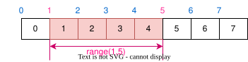


---
# 範囲について

本資料では、これに則して「範囲」を示します。
たとえば、
`left = 1`, `right = 5`の時、対象は添字1〜4で、添字5は含みません


具体的には以下のアルゴリズムの説明で範囲を使います

- クイックソート, マージソート, 二分探索


---
<!-- _class: lead -->
<!-- header: "アルゴリズムとデータ構造" -->

# アルゴリズムとデータ構造


---
# アルゴリズムとデータ構造

- アルゴリズム / Algorithm
  - 問題を解くための手順
- データ構造 / Data Structure
  - データを計算機内に格納するための形式
  - 変数や配列もデータ構造の一種

---
# アルゴリズムの例：最大公約数を求める

2つの自然数の最大公約数を求めるにはどうすればいいでしょうか？


---
<!-- _class: content-image-right content-60 -->

# アルゴリズムの例：連除法


学校で習った方法を手順に書き下してみましょう

例
- 2つの数をともに割り切る数を見つける
  - 2から1つずつ増やして見つける
  - 2つの数の小さい方以下の数を調べる
- 割り切れる数で、2つの数を割る
- 両方を割り切る2以上の数が見つからなくなるまで続ける
- 割るために使った数をすべて掛け合わせると答えになる（1回も割れなければ1）

これがアルゴリズム（問題を解くための手順）

---
# 連除法の実装

実際に実装すると以下のようになる

```python
def gcd_short_division(a: int, b: int) -> int:
    d : int = 2
    ans : int = 1

    while d <= a and d <= b:
        if a % d == 0 and b % d == 0:
            a = a // d
            b = b // d
            ans = ans * d
        else:
            d = d + 1
    
    return ans
```
---
# 別解 : ユークリッドの互除法

最大公約数を求めるには、もっと効率の良い方法がある

```python
def gcd_euclidean(a: int, b: int) -> int:
    while b != 0:
        a, b = b, a % b
    return a
```

アルゴリズムを知ると効率のよいプログラムが書けるようになる

---

<!-- _class: lead -->
<!-- header: "オーダー計算" -->

# 計算量
効率の良いアルゴリズムとは？

---
# 計算量

入力の大きさに対する、処理回数や必要なメモリの増え方を見積もる
- データ数などを$n$、基本操作の実行回数を$f(n)$とする
- ある正の定数$c$と$n_0$が存在し、すべての$n \geq n_0$で$f(n) \leq c g(n)$なら、$f(n) = O(g(n))$と表す
  - $g(n)$の例：$n$、$n^2$、$\log n$、$n\log n$
- 以下では、比較や代入などの基本操作を定数時間として数える
  - 必要なメモリの増え方は「空間計算量」と呼ぶ

---
<!-- _class: code-columns -->
# 計算量の例(1)

<div class="code-columns">

```

1

1
n
n

1
```

```python
def main():
    n : int = int(input("n = "))

    s : int = 0
    for i in range(1, n + 1):
        s = s + i
    
    print(f"s = {s}")
```

</div>

$f(n) \approx 2n + 3$（ループ終了時の判定などは省略） 

$2n + 3 \leq 2n + 3n = 5n$ より　$g(n) = n$．
よって計算量は **$O(n)$**

---
<!-- _class: code-columns -->
# 計算量の例(2)

<div class="code-columns">

```

1

1
log_2 n
log_2 n
log_2 n

1
```

```python
def main():
    n : int = int(input("n = "))

    s : int = 0
    while n > 1 :
        n = n // 2
        s = s + n
    
    print(f"s = {s}")
```

</div>

正の整数$n$に対し、繰り返し回数は$\lfloor \log_2 n \rfloor$回になる

ループ終了時の判定などを省けば$f(n) \approx 3\lfloor \log_2 n \rfloor + 3$。よって計算量は **$O(\log n)$** 
※ オーダー表記では $\log$の基数も無視して表記する

---
# 計算量の目安

処理回数は、入力サイズ$n$を計算量の式に当てはめて見積もる

$10^8$回を目安にする場合もあるが、実行時間は処理内容・言語・環境に依存する。

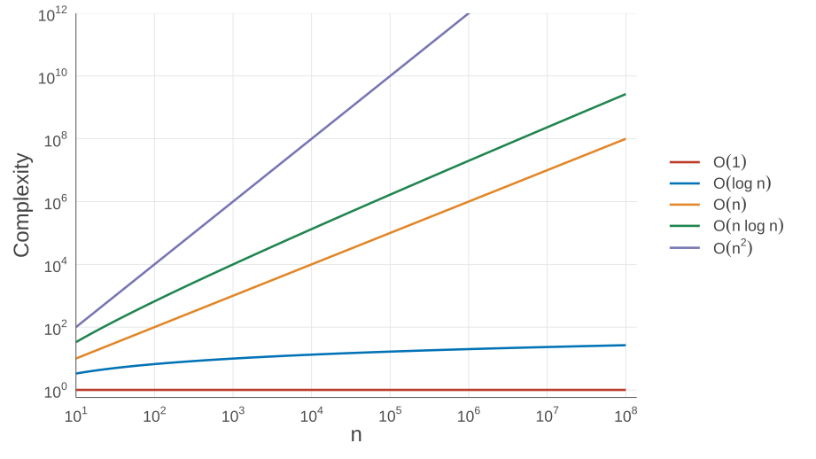

---
<!-- _class: lead -->
<!-- header: "ソート" -->

# ソート
ならべかえ

---
# ソート

複数のデータを一定の規則に従って順番通りに並べ替えること。

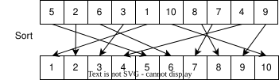

「どうやって並べ替えるか？」について、多くのアルゴリズムが提案されている

---
<!-- _class: lead -->
<!-- header: "ソート | バブルソート" -->

# バブルソート
泡のように大きい数値が後ろに進むソート

---
# バブルソート

- 先頭から隣の要素と比較して、順番が逆転していたら入れ替える。
- これを、1つずつずらしながら繰り返すと、一番大きい数値が最後で確定する
- すべての要素が確定するまでこれを繰り返す
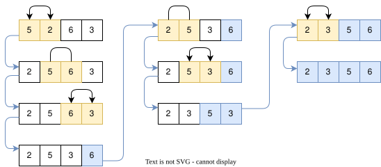

---
# アルゴリズムに書き下してみる

要素数 N の配列 data を昇順に並べ替える。添字は 0 から N − 1 とする。

- 確定させる位置 i を N − 1 から 1 まで、1 ずつ減らしながら繰り返す
  - 比較する位置 j を 0 から i − 1 まで、1 ずつ増やしながら繰り返す
    - data[j] > data[j + 1] なら、両者を入れ替える
  - この時点で、位置 i の値が確定する

---
# ソースコードで書いてみる

```python
def bubble_sort(data: list[int]):
    n: int = len(data)

    for i in reversed(range(1, n)):
        for j in range(0, i):
            if data[j] > data[j + 1]:
                data[j], data[j + 1] = data[j + 1], data[j]
```
---
# ソースコードの補足

|||
|--|--|
|`len(data)`| 配列dataの要素数 |
|`range(1, n)`| 1からn - 1までの整数列 |
|`reversed()`| 整数列を逆転させる |
|`a, b = b, a`| aとbをスワップ（入れ替え）する |

---
# 計算量

計算量は$O(n^2)$（下の回数は概算。交換回数は入力に依存する）

<div class="code-columns">

```

1

n - 1
n(n-1)/2
n(n-1)/2
n(n-1)/2
```

```python
def bubble_sort(data: list[int]):
    n: int = len(data)

    for i in reversed(range(1, n)):
        for j in range(0, i):
            if data[j] > data[j + 1]:
                data[j], data[j + 1] = data[j + 1], data[j]
```

</div>


---
<!-- _class: lead -->
<!-- header: "ソート | 挿入ソート" -->

# 挿入ソート
順番に挿入していくソート

---
# 挿入ソート

- 0からi - 1番目までの要素がソートされている時、i番目を正しい位置に挿入する
- 0からi番目までソートされている状態になったのでiを1増やしながら繰り返す

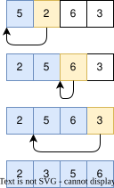

---
# ソースコードで書いてみる

```python
def insertion_sort(data: list[int]):
    n: int = len(data)

    for i in range(1, n):
        j: int = i - 1
        while j >= 0 and data[j] > data[j + 1]:
            data[j], data[j + 1] = data[j + 1], data[j]
            j -= 1
```

---
# 計算量

平均・最悪の計算量は$O(n^2)$（下の回数は逆順の入力での概算）（下の回数は概算。交換回数は入力に依存する）

<div class="code-columns">

```

1

n-1
n-1
n(n-1)/2
n(n-1)/2
n(n-1)/2
```

```python
def insertion_sort(data: list[int]):
    n: int = len(data)

    for i in range(1, n):
        j: int = i - 1
        while j >= 0 and data[j] > data[j + 1]:
            data[j], data[j + 1] = data[j + 1], data[j]
            j -= 1
```

</div>

`while`の回数は、`data`に依存する
最初からソートされている場合は、$O(n)$で終わる

---
<!-- _class: lead -->
<!-- header: "再帰関数" -->

# 再帰関数
自らを呼び出す関数

---
# 再帰関数とは

関数内で自分自身を呼び出す手法
- 大きな問題を小さな問題に分割して解決する分割統治法で使われる手法

再帰関数の特徴
- 何らかの再帰終了条件を持つ
- 状態を変えながら再帰終了条件に進んでいく
- 再帰的に関数自身を呼び出す

---
# 再帰関数の例

1からnまでの自然数の和を求める関数

```python
def sum_recursive(n: int):
    if n <= 0:
        return 0
    return n + sum_recursive(n - 1)
```

以下のような漸化式をイメージすると分かりやすいかもしれない

$f(n) = \begin{cases} 
 0 & n \leq 0 \\
 n + f(n - 1) & n > 0
\end{cases}$

---
<!-- _class: content-image-right content-50 -->
# 関数が呼び出される様子

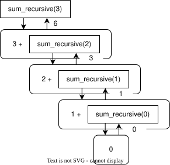

`sum_recursive(3)`の中で`sum_recursive(2)`が呼び出されて...ということを繰り返す

関数を繰り返し呼び出すので、スタックメモリを沢山使う

※ 再帰の深さには上限があり、`sys.getrecursionlimit()`で確認できる（通常は1000程度）

---
# フィボナッチ数

直前の2つの数を足し合わせて作る数列。以下では$n$を0以上の整数とする

$
f(n) = \begin{cases}
0 & n = 0 \\
1 & n = 1 \\
f(n - 1) + f(n - 2) & n \geq 2
\end{cases}
$

---
# フィボナッチ数を再帰関数で実装してみる

```python
def fib(n: int) -> int:
    match n:
        case 0:
            return 0
        case 1:
            return 1
        case _:
            return fib(n - 1) + fib(n - 2)
```

---
# ソースコードの補足

`match`はPython 3.10から追加されたパターンマッチングの構文

- 上から順番に評価される
  - `case 0` で `n`が0の時
  - `case _` は全部マッチングする（それ以外の意味で最後につかう）

ガード条件を使ってこんな風にも書けます
```python
def fib(n: int) -> int:
    match n:
        case x if x <= 1:
            return x
        case _:
            return fib(n - 1) + fib(n - 2)
```

---
# 関数が呼び出される様子

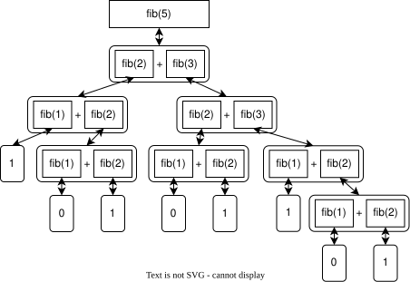

---
# 計算量

フィボナッチ数を再帰関数で実装した時の計算量は $O(2^n)$

|n | 関数呼出回数　|
|:--:|--:|
|5 | 15|
|10|177|
|20|21,891|
|30|2,692,537|

n = 40では約3億3千万回の関数呼び出しが発生し、実行に時間がかかる

---
# ループで実装する

この場合の計算量は$O(n)$
```python
def fib_loop(n: int) -> int:
    if n == 0:
        return 0
    fib: list[int] = [0 for _ in range(0, n + 1)]
    fib[1] = 1

    for i in range(2, n + 1):
        fib[i] = fib[i - 2] + fib[i - 1]
    return fib[n]
```

<div class="notification info">
この解き方は「動的計画法」という名前がついているが、この資料のスコープ外
</div>

---
# 何故再帰関数を使うのか

再帰関数と同じ処理をループで書くことも可能であるが、再帰関数のメリットも多い

- アルゴリズムの本質をそのまま書ける
  - 処理の意図が分かりやすくバグが減る
- 複雑な階層構造を簡単に扱える
  - 記述が洗練され、コードが短くなる傾向

ただし、再帰が深くなるとメモリ使用量が増え、再帰の上限に達する。フィボナッチ数の例のように同じ計算を繰り返すと、処理回数も大きく増える

---
# [発展] メモ化再帰 / Memoization

関数の返り値をキャッシュしておき、同じ引数で呼び出された時、その値を返す

Pythonの場合`@cache`をつけるだけでOK

```python
from functools import cache

@cache
def fib(n: int) -> int:
    match n:
        case x if x <= 1:
            return x
        case _:
            return fib(n - 1) + fib(n - 2)
```

この時の計算量は$O(n)$になる

---
<!-- _class: lead -->
<!-- header: "ソート | クイックソート" -->

# クイックソート

基準値との大小で、繰り返し要素を仕分ける

---
# クイックソートのアルゴリズム

- 配列内の要素から基準値（pivot）を決める
- pivot未満の要素を左側、pivot以外のpivot以上の要素を右側に分ける
- pivotをその間に置き、pivotを除く左右をそれぞれクイックソートする

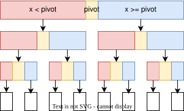

---
# クイックソートの動作例

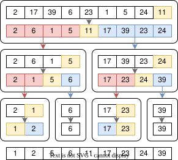


---
# クイックソートの実装

pivotを決め、配列を前半と後半に分ける関数`partition()`を使うと以下のように書ける

```python
def quick_sort(data: list[int], left: int, right: int):
    if right - left <= 1:
        return
    pivot_index: int = partition(data, left, right)
    quick_sort(data, left, pivot_index)
    quick_sort(data, pivot_index + 1, right)
```

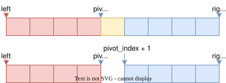

---
# partition関数の動き

`partition(data:list[int], left: int, right: int) -> int`

対象範囲は空でないことを前提とする（`quick_sort`では要素が2個以上の時だけ呼ぶ）

1. pivotを決める（今回は一番右側の要素）
2. pivotとの大小で要素を並べ替え、pivotを左右の境界に置く
3. pivotの位置を返す

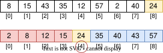

---
<!-- _class: content-image-right content-60 -->
# partition関数の動き | 並び替えの詳細

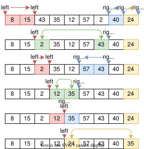

1. rightを1減らす(pivotの分)
2. `data[left] < pivot`ならleftを増やし、`data[right - 1] >= pivot`ならrightを減らす（いずれもleft < rightの間）
3. left < rightであればleftの要素とright - 1の要素を入れ替える
4. 2, 3を left < rightの間繰り返す
5. pivotとleftの位置の要素を入れ替える

n個の要素を1回ずつ参照するので計算量は$O(n)$


---
# partition関数の実装

```python
def partition(data: list[int], left:int, right:int) -> int:
    pivot_index: int = right - 1
    pivot: int = data[pivot_index]
    right = right - 1
    while left < right:
        while left < right and data[left] < pivot:
            left += 1
        while left < right and data[right - 1] >= pivot:
            right -= 1
        if left < right:
            data[left], data[right - 1] = data[right - 1], data[left]
    data[pivot_index], data[left] = data[left], data[pivot_index]
    return left
```
---
<!-- _class: content-image-right content-40 -->
# クイックソートの計算量

平均計算量は$O(n\log n)$

- 各段での仕分けの計算量の合計は$O(n)$
- 分割がほぼ均等なら、深さは$O(\log n)$
  - 対象の要素数がおよそ半分ずつ減少

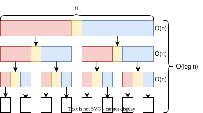

---
<!-- _class: content-image-right content-50 -->
# クイックソートの計算量（最悪値）

計算量の最悪値は$O(n^2)$

- pivotが常に最大値か最小値の時

Quick Sortはpivotの取り方で性能が変わってしまう

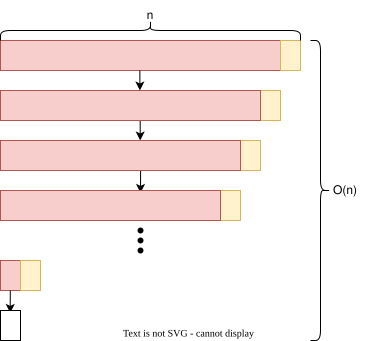


---
# pivotの選び方を変えてみる

pivotが最大値や最小値だと、分割が偏りやすい

3つの位置の値の中央値を選び、極端な偏りを減らす（重複値などがあるため、最悪計算量の改善は保証しない）

中央値とその位置を返す関数
```python
def median3(data: list[int], i: int, j: int, k: int) -> tuple[int, int]:
    x, y, z = data[i], data[j], data[k]

    if x <= y <= z or z <= y <= x:
        return y, j
    if y <= x <= z or z <= x <= y:
        return x, i
    return z, k
```

---
# partition関数の変更

partition関数の最初を少し変えれば残りはそのまま使える

```python
def partition(data: list[int], left: int, right: int) -> int:
    pivot, pivot_index = median3(
        data, left, right - 1, (left + right - 1) // 2
    )

    data[pivot_index], data[right - 1] = data[right - 1], data[pivot_index]
    pivot_index = right - 1
    right -= 1

    while left < right:
        # 以下は元のpartition関数と同じ（省略）
        ...
```

---
<!-- _class: lead -->
<!-- header: "ソート | マージソート" -->

# マージソート

2つのリストを結合する

---
<!-- _class: content-image-right content-60 -->
# マージソートの概要

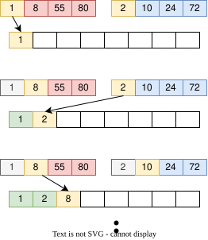

既にソートしてあるリストが2つあったとき、先頭から小さい方を順番に選んでいけばソートできる

2つのリストをどうやってソートするか？
→ マージソート (再帰関数)

---
# マージソートのソース

`data[left]`から`data[right - 1]`までをソートする関数


```python
def merge_sort(data: list[int], left: int, right: int):
    if right - left <= 1:
        return
    mid: int = (left + right) // 2
    merge_sort(data, left, mid)
    merge_sort(data, mid, right)
    merge_list(data, left, mid, right)
```

---
# リストをマージする部分 (前半)

前半と後半のどちらかの要素をすべて取り出すまでループする（`p`、`q`は各範囲の現在位置）

```python
def merge_list(data: list[int], left: int, mid: int, right: int):
    p : int = left
    q : int = mid

    working : list[int] = [0] * (right - left)
    s : int = 0
    
    while p < mid and q < right:
        if data[p] < data[q]:
            working[s] = data[p]
            p += 1
        else:
            working[s] = data[q]
            q += 1
        s += 1
```

---
# リストをマージする部分 (後半)

余った分を`working`に入れていく

```python
    while p < mid:
        working[s] = data[p]
        s += 1
        p += 1
    
    while q < right:
        working[s] = data[q]
        s += 1
        q += 1
    
    data[left:right] = working
```

---
# ソースコードの補足

|||
|---|---|
|`[0] * (right - left)`|長さ`(right - left)`の値が全部0のリストを作る|
|`data[left:right] = working`|`data[left]`から`data[right - 1]`に`working`を代入する。`working`の長さが`right - left`なので丁度おさまる|

---
# 計算量

計算量は $O(n\log n)$
  - マージ処理の計算量は$O(n)$
  - 半分ずつに分けていくので深さは$O(\log n)$

ただし、ワーキングメモリが$O(n)$で必要

---
<!-- _class: lead -->
<!-- header: "ソート | まとめ" -->

# ソートのまとめ

---
# 計算量

マージソートが優秀ではあるが、メモリの使用量（空間計算量）は多め
|アルゴリズム|平均値 | 最善値 | 最悪値 |
|--|:--:|:--:|:--:|
|バブルソート   |$O(n^2)$|$O(n^2)$|$O(n^2)$|
|挿入ソート     |$O(n^2)$|$O(n)$ | $O(n^2)$|
|クイックソート |$O(n\log n)$|$O(n\log n)$ | $O(n^2)$|
|マージソート     |$O(n\log n)$|$O(n\log n)$ | $O(n\log n)$|

---
# Pythonのソートは何なのか？

最近の言語ではソートは用意されているので実装することは少ない

```python
b: list[int] = sorted([73, 13, 30, 95])
```

CPython（Pythonのリファレンス実装）で使われているアルゴリズムは？
- Timsortを基礎とする安定ソート
  - 整列済みの区間を利用し、挿入ソートとマージを組み合わせる
- 3.11以降は、マージ順序の決定にPowersortを採用
  
計算量の平均は$O(n\log n)$, 最善値は$O(n)$

---
<!-- _class: lead -->
<!-- header: "探索" -->

# 探索 / Search

---
# 探索とは

データの中から、目的のデータ（キー）を探し出すこと

- キーがあるかどうか探す
- リストからキーのある位置を得る
- キーに紐づいたコンテンツを取得する

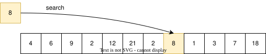

---
<!-- _class: lead -->
<!-- header: "探索 | 線形探索" -->

# 線形探索 / Linear Search

---
# 線形探索

リストの0から順番に目的の値があるかどうか確認する

一番シンプルな探索

---
# 線形探索の実装

リスト内にデータがあれば、そのインデックス。なければ`None`を返す。

```python
def linear_search(data: list[int], key: int) -> int | None:
    for i in range(0, len(data)):
        if data[i] == key:
            return i
    return None
```

---
<!-- _class: lead -->
<!-- header: "探索 | 二分探索" -->

# 二分探索 / Binary Search

---
# 二分探索

探索対象のリストが**昇順にソートされている時**使える

- 中央の値がキーより小さければ右半分、大きければ左半分を調べる
- 値が見つかるか、探索範囲が空になるまで繰り返す
  


---
<!-- _class: content-image-right content-60 -->
# 二分探索の動作

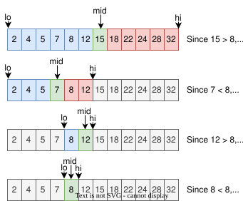

1. lo = 0, hi = n とする
2. lo < hiなら、mid = (lo + hi) // 2 とする（そうでなければ5へ）
3. midの位置の要素とキーを比較する
    - 等しければmidを返す
    - キーが大きければ lo = mid + 1
    - キーが小さければ hi = mid
4. lo < hi の間2, 3を繰り返す
5. 見つからなければNoneを返す

---
# 二分探索の実装

```python
def binary_search(data: list[int], key:int) -> int | None:
    lo : int = 0
    hi : int = len(data)

    while lo < hi:
        mid : int = (lo + hi) // 2
        if data[mid] == key:
            return mid
        elif data[mid] > key:
            hi = mid
        else:
            lo = mid + 1

    return None
```

---
<!-- _class: lead -->
<!-- header: "探索 | ハッシュ探索" -->

# ハッシュ探索

---
<!-- _class: content-image-right content-60 -->
# ハッシュ探索

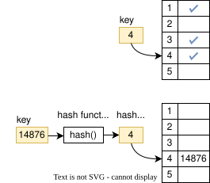

- もしキーが 1〜5の整数値だけだったら？
  - 5要素のリストを用意し、添字`キー - 1`で有無を管理
- キーの範囲が大きい場合
  - ハッシュ関数を用意してインデックスを決める
  - キーと合っているかは確認する

---
# ハッシュ関数

ハッシュ関数には以下のような事が求められる
- 低コスト : 計算コストが十分小さい
- 決定性 : 同じキーに対するハッシュ値は等しい
- 一様性 : キーに対してハッシュ値がばらけている

今回は、以下のようなハッシュ関数を使う

```python
HASH_SIZE: int = 190979
HASH_COEFF: int = 67

def hash_func(key:int) -> int:
    return (key * HASH_COEFF) % HASH_SIZE
```

---
# ハッシュテーブルの宣言

ハッシュテーブルの実体は、`HASH_SIZE`の大きさのリスト

「何もない」ことを示すために`None`を入れておく

```python
def main():
    hash_table : list[int|None]= [None for _ in range(HASH_SIZE)]
```

---
# ハッシュテーブルへの挿入

ハッシュ値を計算して、テーブルの該当する場所にキーを代入する

もし、すでに値が入っていれば`False`を返す

```python
def insert(hash_table: list[int|None], key:int) -> bool:
    hash_value : int = hash_func(key)
    if hash_table[hash_value] is None:
        hash_table[hash_value] = key
        return True
    else:
        return False
```

---
# ハッシュテーブルの探索

ハッシュ値を計算して、テーブルの該当する場所にキーが入っているかどうか確認する

```python
def search(hash_table: list[int|None], key:int) -> bool:
    hash_value : int = hash_func(key)
    if hash_table[hash_value] == key:
        return True
    else:
        return False
```
---
# ハッシュテーブルからの削除

ハッシュ値を計算して、テーブルの該当する場所を`None`にする

```python
def remove(hash_table: list[int|None], key:int) -> bool:
    hash_value : int = hash_func(key)
    if hash_table[hash_value] == key:
        hash_table[hash_value] = None
        return True
    else:
        return False
```
---
# 衝突 / Collision

異なるキーから同じハッシュ値が得られる現象を「衝突」と呼ぶ
ここまでの単純な実装では、衝突したキーを追加できない

衝突の解決方法として、チェイン法やオープンアドレス法などがある

- チェイン法 / Separate Chaining
  - ハッシュテーブルからリストなど他のデータ構造につなげる
- オープンアドレス法 / Open Addressing
  - 衝突した場合、次のエントリなどハッシュテーブルの他の場所に保存する


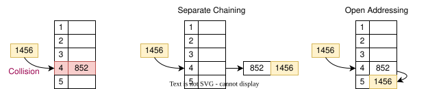

---
# オープンアドレス法

ハッシュテーブルは、キーの他に「空き」と「削除済」の2つの値を持つ

```python
from enum import Enum

class Marker(Enum):
    EMPTY = "empty"
    DELETED = "deleted"

def main():
    hash_table : list[int|Marker]= [Marker.EMPTY for _ in range(0, HASH_SIZE)]
```

---
# オープンアドレス法 | 挿入

```python
def insert(hash_table: list[int|Marker], key:int) -> bool:
    index : int = hash_func(key)
    insert_index : int | None = None

    for _ in range(HASH_SIZE):
        match hash_table[index]:
            case value if value == key:
                return True
            case Marker.EMPTY:
                if insert_index is None:
                    insert_index = index
                break
            case Marker.DELETED:
                if insert_index is None:
                    insert_index = index
        index = (index + 1) % HASH_SIZE

    if insert_index is None:
        return False
    else:
        hash_table[insert_index] = key
        return True
```

---
# オープンアドレス法 | 検索

```python
def search(hash_table: list[int|Marker], key:int) -> bool:
    index : int = hash_func(key)

    for _ in range(HASH_SIZE):
        match hash_table[index]:
            case value if value == key:
                return True
            case Marker.EMPTY:
                return False
        index = (index + 1) % HASH_SIZE
    return False
```

---
# オープンアドレス法 | 削除

```python
def remove(hash_table: list[int|Marker], key:int) -> bool:
    index : int = hash_func(key)
    
    for _ in range(HASH_SIZE):
        match hash_table[index]:
            case value if value == key:
                hash_table[index] = Marker.DELETED
                return True
            case Marker.EMPTY:
                return False
        index = (index + 1) % HASH_SIZE
    return False
```

---
<!-- _class: lead -->
<!-- header: "探索 | まとめ" -->

# 探索のまとめ

---
# 探索のまとめ

ハッシュ探索は、衝突が少なければ平均$O(1)$で探索できる

衝突が多いと性能が低下するため、ハッシュ関数やテーブルの充填率に配慮する

| アルゴリズム | 平均 | 最悪 |
|:---|:---|:---|
| 線形探索 | $O(n)$ | $O(n)$ |
| 二分探索 | $O(\log n)$ | $O(\log n)$ |
| ハッシュ探索 | $O(1)$ | $O(n)$ |

※ ハッシュ探索は適切な分散と充填率を仮定。二分探索の整列コストは含めない

---
# Pythonでの実装

多数のデータを扱うときは、計算量を考えて選択する必要がある

`list`の探索 : 線形探索
```python
a : list[int] = [ 1, 3, 5, 7 ]
if 3 in a:
    print("True")
```

`set`,`dict`の探索 : ハッシュ探索
```python
a : set[int] = set([ 1, 3, 5, 7 ])
if 3 in a:
    print("True")
```

---
<!-- _class: lead -->
<!-- header: "構造体" -->
# 構造体 / Structure 

---
# 構造体とは

複数の値を組み合わせて、ひとまとまりのデータとして扱うにはどうすればいいのか？

例えば
- グラフ上の座標
- ベクトル
- 住所録のエントリ（氏名, 住所, 電話番号, ...）
- ステータス（HP, MP, STR, DEX, ...）

複数のデータをまとめた「構造体」を使う

---
# 練習課題

二次元座標 `(x, y)`を2点入力しそれらの間の距離を求める

入力
```
x1 = 1
y1 = 1
x2 = 4
y2 = 5
```

出力
```
distance = 5.000
```

---
# 構造体を使わないプログラム例

```python
import math

def main():
    x1: float = float(input("x1 = "))
    y1: float = float(input("y1 = "))
    x2: float = float(input("x2 = "))
    y2: float = float(input("y2 = "))
    
    d: float = math.sqrt( math.pow(x1 - x2, 2) + math.pow(y1 - y2, 2) )
    print(f"distance = {d:.3f}")
    
if __name__ == "__main__":
    main() 
```
---
# 構造体

プログラムを書く人が、x1, y1 がセットで1つの座標を示していることを常に意識する必要がある

```python
    x1: float = float(input("x1 = "))
    y1: float = float(input("y1 = ")) 
```

座標を表していることがわかるように `(x, y)` のセットにPointという名前をつけたい


---
# 構造体の定義

`dataclasses`という標準ライブラリから`dataclass`機能を読み込む

`class`の下に構造体のメンバ変数をならべる
以下の`Point`という構造体は`x` と `y`の2つの`float`の値を持つ

```python
from dataclasses import dataclass

@dataclass
class Point:
    x: float
    y: float
```

<div class="notification info">
Pythonに構造体 (struct) はないのでクラスを使う。そのため「クラス」と呼ぶのが正しいが、本資料では、複数のデータをまとめる目的にしか使わないので、構造体とクラスを区別せず「構造体」と呼ぶ。
</div>


---
# 構造体 | インスタンス化

新しく`Point`というデータ型があるように扱える。
変数を作るときは定義した順番に引数を渡す。
```python
p : Point = Point(1, 2)
```
`print`で表示も可能
```python
print(p)
```
```shell
Point(x=1, y=2)
```

<div class="notification info">
メンバ変数名を指定するキーワード引数なら、定義順と異なっていても渡せる

`p: Point = Point(y=2, x=1)`
</div>


---
# 構造体 | メンバ変数へのアクセス

メンバ変数には`.x`, `.y`のようにしてメンバ変数名を使ってアクセスする
```python
p : Point = Point(5, 3)
print(f"Position ({p.x}, {p.y})")
```

書き込みも可能
```python
p.x = 4
p.y = 2
```

---
# 構造体の定義 | 初期値

定義の右側に `=`をつけることで初期値を設定できる

```python
@dataclass
class Point:
    x: float = 0
    y: float = 0
```

初期値を設定したメンバ変数は、引数を省略できる

```python
p : Point = Point()
```

---
# 構造体の定義 | 初期値の注意点

定義の時に必ず初期値がないメンバ変数 → 初期値があるメンバ変数の順にならべる
以下のコードはエラーになる
```python
@dataclass
class Point:
    x: float = 0
    y: float
```

<div class="notification warning">
リストなどの変更可能な値を初期値にする場合は、`field(default_factory=list)`などを使う。詳細は本資料の対象外とする
</div>

---
# 構造体を引数とする関数

通常のデータ型と同様に使うことができる

例：2つの`Point`型を引数として距離を返す`distance`関数
```python
def distance(p1: Point, p2: Point) -> float:
    return math.sqrt(math.pow(p1.x - p2.x, 2) + math.pow(p1.y - p2.y, 2))
```

---
# 構造体を引数とする関数 | 値が変更される例


ただし、構造体を引数とした時、関数内で値を変更すると反映されるので注意

```python
def set_x_five(p: Point):
    p.x = 5

def main():
    p: Point = Point(0, 0)
    set_x_five(p)
    print(f"({p.x}, {p.y})")
```
```shell
(5, 0)
```

<div class="notification alert">
Pythonでは、list や dictも関数内で変更すると関数外にも反映される。
</div>

---
# [参考] intやfloatでは値が変更されない

`int`や`float`の値自体は変更できない。引数`a`への再代入は、呼び出し元の変数`x`には影響しない

```python
def set_five(a: int):
    a = 5

def main():
    x: int = 0
    set_five(x)
    print(x) # 0が表示される
```
```shell
0
```
<div class="notification warning">
引数への再代入と、参照先のオブジェクトの変更を区別する。再代入は`list`や`dict`でも、呼び出し元の変数には影響しない
</div>


---
# 構造体を引数とする関数 | 値が変更されないようにする

元の`Point`の値を変更したくない時は、コピーして渡す

```python
import copy

def set_x_five(p: Point):
    p.x = 5

def main():
    p: Point = Point(0, 0)
    set_x_five(copy.copy(p))
    print(f"({p.x}, {p.y})")
```
```shell
(0, 0)
```
ただし、コピーの処理コストがかかる。`copy.copy`は浅いコピーなので、メンバがリストなどの場合、そのリストは共有される

---
# 構造体を戻り値とする関数

例: 2つの値をユーザから入力してもらい、`Point`構造体を返す関数

```python
def input_point() -> Point:
    x: float = float(input("x = "))
    y: float = float(input("y = "))
    p: Point = Point(x, y)
    return p
```


---
# 構造体を使って書き直す

これまでの構造体, 関数を使うと以下のように書ける

```python
def main():
    print("p1:")
    p1: Point = input_point()
    print("p2:")
    p2: Point = input_point()

    d = distance(p1, p2)
    print(f"distance = {d:.3f}")
```

---
<!-- _class: lead -->
<!-- header: "データ構造 | スタック" -->

# スタック / Stack

---
<!-- _class: content-image-right content-60 -->

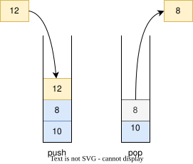

# スタックとは

データを上に積み上げていくデータ構造　

- push
  - スタックの一番上にデータを入れる
- pop
  - スタックの一番上のデータを取り出す

LIFO (Last In, First Out) とも呼ぶ

---
# スタックの実装 

定義
  - top : 次に格納する位置（格納済みの要素数）を示す。初期値は0
  - data : データを保存するスタックの実体
  
```python
@dataclass
class Stack:
    data: list[int]
    top: int = 0
```

宣言時にはデータを保存するリストを渡す
```python
def main():
    stack : Stack = Stack([0] * 10)
```
---
# Push

`top`の位置に値を入れる。
もし、dataがいっぱいなら `False`を返す

```python
def push(stack: Stack, value: int) -> bool:
    if stack.top >= len(stack.data):
        return False
    stack.data[stack.top] = value
    stack.top += 1
    return True
```
---
# Pop

`top`を1減らし、その位置の値を取り出して返す
スタックが空なら`None`を返す

```python
def pop(stack: Stack) -> int | None:
    if stack.top <= 0:
        return None
    stack.top -= 1
    value : int = stack.data[stack.top]
    return value
```
---
<!-- _class: lead -->
<!-- header: "データ構造 | キュー" -->

# キュー / Queue 

リングバッファ (Ring Buffer) での実装

---
<!-- _class: content-image-right content-60 -->
# キュー / Queue

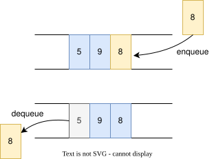

待ち行列のようなデータ構造　

- enqueue
  - キューの一番後ろにデータを入れる
- dequeue
  - キューの先頭のデータを取り出す

FIFO (First In, First Out) とも呼ぶ

---
# キューをリストで実装しようとすると...

リストの先頭を`pop(0)`で取り出す実装では、残りの要素を1つずつ前へ移動する

$O(n)$の処理が必要となる

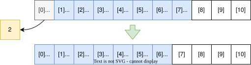

---
<!-- _class: content-image-right content-60 -->
# リングバッファ / Ring Buffer

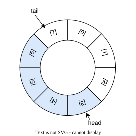

キューの実装方法の1つ

- head
  - キューの先頭
  - 次に取り出されるデータの位置
- tail
  - キューの末尾
  - 次にデータが挿入される位置
- count
  - キューに入っているデータの数

---
# キューの実装

定義  
```python
@dataclass
class Queue:
    data: list[int]
    head: int = 0
    tail: int = 0
    count: int = 0
```

宣言時にはデータを保存するリストを渡す
```python
def main():
    queue : Queue = Queue([0] * 10)
```

---
# enqueue

`tail`の位置にデータを入れる
もし、キューがいっぱいなら `False`を返す

```python
def enqueue(queue: Queue, value: int) -> bool:
    n : int = len(queue.data)
    if queue.count >= n:
        return False
    queue.data[queue.tail] = value
    queue.tail = (queue.tail + 1) % n
    queue.count += 1
    return True
```

---
# dequeue

`head`の位置のデータを取り出して返す
もし、データがないなら `None`を返す

```python
def dequeue(queue: Queue) -> int | None:
    n : int = len(queue.data)
    if queue.count <= 0:
        return None
    value : int = queue.data[queue.head]
    queue.head = (queue.head + 1) % n
    queue.count -= 1
    return value
```
---
<!-- _class: lead -->
<!-- header: "オブジェクト識別子" -->

# オブジェクト識別子 / Object Identifier

Pythonの変数とオブジェクトの関係

---
# オブジェクト識別子 / Object Identifier

Pythonの変数は、オブジェクトに付けた名前と考えられる。`id()`で得られる「オブジェクト識別子」は、そのオブジェクトを識別する整数である。

インタラクティブモードで確認するのがわかりやすいので確認してみる

```shell
% python3
>>> a = 3
>>> id(a)
4353024928
```

図は参照関係を番号で表した模式図（識別子の数値は実行ごとに異なる）


---
# 変数の値の変更

変数の中身を変えるとどうなるのか？ 指し示すオブジェクトが変わる

```shell
>>> a = 5
>>> id(a)
4349043616
```

図示するとこんなイメージである

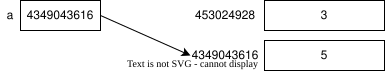

`int`、`float`、`bool`は値自体を変更できません。この例では、再代入により別のオブジェクトを指すため、識別子が変わります

---
# オブジェクトの変更

`list`などの**中の**値を変えても指し示すオブジェクトは変わらない

```shell
>>> b = [1, 2, 3, 4]
>>> id(b)
4336093440
>>> b[0] = 10
>>> id(b)
4336093440
```
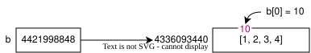

---
<!-- _class: content-image-right content-60 -->
# 同じオブジェクトを指す変数

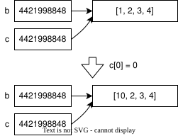

リストを別の変数に代入すると同じオブジェクトを指し示すようになる
```shell
>>> b = [1, 2, 3, 4]
>>> c = b
>>> id(b), id(c)
(4421998848, 4421998848)
```
このため、変更が両方に影響する
```shell
>>> c[0] = 10
>>> b
[10, 2, 3, 4]
```

---
# immutableとmutable

この振る舞いの違いはオブジェクトがimmutable（変更不可）かmutable（変更可）かによって変わる

|mutable| immutable |
|--|--|
| list, dict, set, 構造体 など | int, float, str, tuple など |

同じmutableなオブジェクトを共有すると、その変更が関数外にも見える。引数への再代入は、呼び出し元の変数には影響しない

---
# is と ==

`is` : 同じオブジェクトを指しているか。つまりオブジェクト識別子が同じか
`==` : オブジェクトの中身が同じか

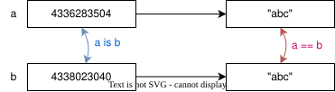

`None`は唯一のオブジェクト（シングルトン）なので、判定には`x is None`または`x is not None`を使う。

---
# リストの繰り返し / List Repetition

```python
a = [0] * 5
```

`list * n`は、元のリストの要素への参照をn回繰り返したリストを作る。要素自体はコピーしないため、下の例では3つの要素が同じ内側のリストを指す

```shell
>>> a = [[1, 2]] * 3
>>> a
[[1, 2], [1, 2], [1, 2]]
>>> a[0][0] = 5
>>> a
[[5, 2], [5, 2], [5, 2]]
```
内包表記で内側のリストを毎回作れば、別々に変更できる
```python
a = [[1, 2] for _ in range(3)]
```

---
<!-- _class: lead -->
<!-- header: "データ構造 | 線形リスト" -->

# 線形リスト（連結リスト）/ Linked List
挿入位置の直前のノードが分かっていれば、効率よく挿入できるデータ構造

---
# 線形リスト

データを数珠つなぎで並べたデータ構造

- データの挿入や削除は矢印のつけ替えで行う

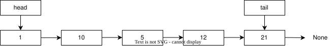


---
# 定義

各ノードは値と次のノードへの参照を持つ
リストは最初と最後のノードへの参照を持つ

```python
@dataclass
class Node:
    value: int
    nextNode: Node | None = None

@dataclass
class LinkedList:
    head: Node | None = None
    tail: Node | None = None
```
---
# 最初のノードの追加

ノードが1つだけなので、`head`と`tail`両方が同じノードを指す

```python
def init_list(lst: LinkedList, value: int):
    new_node: Node = Node(value)
    lst.head = new_node
    lst.tail = new_node
```

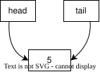


---
# append 

リストの最後にノードを追加する
- `tail`ノードの次のノードを`new_node`にする
- `tail`ノードを`new_node`にする

```python
def append(lst: LinkedList, value: int):
    if lst.tail is None:
        init_list(lst, value)
    else:
        new_node: Node = Node(value)
        lst.tail.nextNode = new_node
        lst.tail = new_node
```

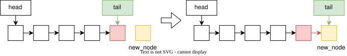

---
# prepend

リストの最初にノードを追加する
- `new_node`の次のノードを`head`ノードにする
- `head`ノードを`new_node`にする

```python    
def prepend(lst: LinkedList, value: int):
    if lst.head is None:
        init_list(lst, value)
    else:
        new_node : Node = Node(value)
        new_node.nextNode = lst.head
        lst.head = new_node
```

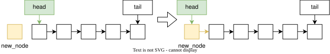


---
# pop_front

先頭の要素を取り出して返す
- `head`ノードを`target`にする
- `target`ノードの次のノードを`head`ノードにする


```python
def pop_front(lst: LinkedList) -> int | None:
    if lst.head is None:
        return None
    target = lst.head
    lst.head = target.nextNode
    if lst.head is None:
        lst.tail = None
    return target.value  
```

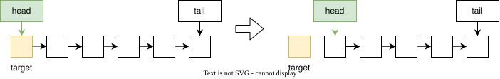


---
# node_at

`index`番目のノードを返す（先頭は0番目）

順番に`index`回、ノードを辿っていく必要がある

```python
def node_at(lst: LinkedList, index: int) -> Node | None:
    if index < 0:
        return None

    node : Node | None = lst.head
    for _ in range(index):
        if node is None:
            return None
        node = node.nextNode

    return node
```

---
# insert

`index`番目にノードを追加する

- `node_at()`を使って`index - 1`番目のノードを得る
- `new_node`の次を`index - 1`番目のノードの次のノードにする
- `index - 1`番目のノードの次のノードを`new_node`にする

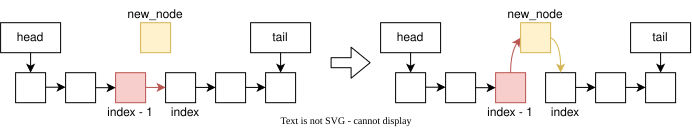

---
# insert
```python
def insert(lst: LinkedList, index: int, value: int) -> bool:
    if index == 0:
        prepend(lst, value)
        return True
    
    previous : Node | None = node_at(lst, index - 1)
    if previous is None:
        return False
    
    new_node: Node = Node(value)
    new_node.nextNode = previous.nextNode
    previous.nextNode = new_node
    
    if new_node.nextNode is None:
        lst.tail = new_node
    
    return True
```

---
# remove

`index`番目のノードを削除する

- `node_at()`を使って`index - 1`番目のノードを得る
- `index - 1`番目のノードの次のノードを`target`にする
- `index - 1`番目のノードの次のノードを`target`の次のノードにする

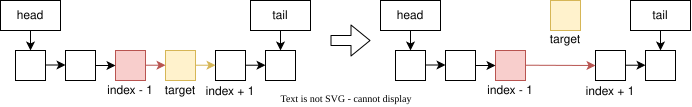

---
# remove

```python
def remove(lst: LinkedList, index: int) -> bool:
    if index == 0:
        return pop_front(lst) is not None

    previous : Node | None = node_at(lst, index - 1)
    if previous is None:
        return False

    target : Node | None = previous.nextNode
    if target is None:
        return False
    
    previous.nextNode = target.nextNode

    if target.nextNode is None:
        lst.tail = previous

    return True
```

---
# 計算量

`insert`, `remove`の処理自体は$O(1)$で完了するが、`index`番目を得るのに$O(n)$必要

|append|prepend|pop_front|insert|remove|
|:---:|:---:|:---:|:---:|:---:|
|$O(1)$|$O(1)$|$O(1)$|$O(n)$|$O(n)$|

---
# 単方向 / 双方向

`pop_back`は最後のノードの前のノードを知るために$O(n)$が必要
前後のノードへ繋がる双方向のLinked Listであれば`pop_back`も$O(1)$で実装可能

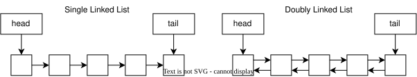

---
# キュー / スタックとの関係

単方向のLinked Listでもキューとスタックの追加・取り出し操作を、いずれも$O(1)$で実装可能

|Linked List| Queue | Stack |
|:---:|:---:|:---:|
|prepend| | push |
|append| enqueue |  |
|pop_front| dequeue | pop |
---
# リストとの比較

Python組み込みのリストと、本資料の単方向連結リスト（tailあり）の比較

| | list | Linked List |
|:---:|:---:|:---:|
|**先頭に挿入**| $O(n)$ | $O(1)$ |
|末尾に挿入| $O(1)$（Amortized） | $O(1)$ |
|途中に挿入| $O(n)$ | $O(n)$ |
|**先頭を削除**| $O(n)$ | $O(1)$ |
|途中を削除| $O(n)$ | $O(n)$ |
|末尾を削除| $O(1)$（Amortized） | $O(n)$ |
|**ランダムアクセス**| $O(1)$ | $O(n)$ |

---
# [参考] 償却計算量（Amortized）とは

一連の操作の合計コストを、操作回数で割って評価する考え方

例：空の動的配列（`list`）への末尾追加
※ 満杯になると容量を2倍に増やす場合

|状態|必要な処理|1回の計算量|
|---|---|---|
|空きがある| 新しい要素を書き込む | $O(1)$ |
|満杯| 容量を増やし、既存の要素をコピーする | $O(n)$ |

$n$回の追加で、コピーする要素数の合計は $1 + 2 + 4 + \cdots < 2n$

書き込みも含めた合計は$O(n)$なので、1回あたり Amortized $O(1)$

---

<!-- _class: lead -->
<!-- header: "データ構造 | 二分木" -->

# 二分探索木 / Binary Search Tree

---
# 二分探索木

探索を高速に行うためのデータ構造

- 左部分木のすべての値は、そのノードの値より小さい
- 右部分木のすべての値は、そのノードの値より大きい
- この実装では、同じ値を重複して格納しない

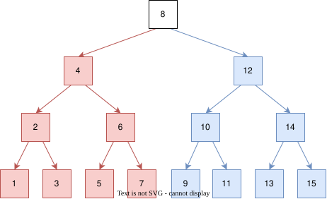


---
# 定義

ノードは値と、左右の子ノードへの参照を持ちます（子がなければ`None`）

```python
@dataclass
class TreeNode:
    value: int
    left: TreeNode | None = None
    right: TreeNode | None = None
```

一番大元のノードを根（root）と呼びます

```python
@dataclass
class BinarySearchTree:
    root: TreeNode | None = None
```

---
<!-- _class: content-image-right content-60 -->
# 基本的な動き

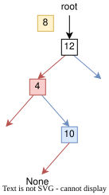

挿入/検索する値との大小でたどっていって値を探す
- 挿入/検索する値が大きければ右へ
- 挿入/検索する値が小さければ左へ

目的の値かNoneがでてきたら終了
- 検索する時にNoneがでたら値が入っていない
- 挿入する時にNoneがでたらそこに挿入

---
# 探索 / search

```python
def search(tree: BinarySearchTree, value: int) -> TreeNode | None:
    node: TreeNode | None = tree.root
    while node is not None:
        if node.value == value:
            return node
        elif node.value > value:
            node = node.left
        else:
            node = node.right
    return None
```

---
# 挿入 / insert

挿入は再帰で書いた方が書きやすい

```python
def insert(tree: BinarySearchTree , value: int):
    tree.root = insert_impl(tree.root, value)

def insert_impl(node: TreeNode | None, value: int) -> TreeNode:
    if node is None:
        return TreeNode(value)
    elif node.value == value:
        return node
    elif node.value > value:
        node.left = insert_impl(node.left, value)
        return node
    else:
        node.right = insert_impl(node.right, value)
        return node
```

---
# 削除 / remove

木の構造を保ったままノードを削除するのは少し面倒
削除するノードの子が
- なければ、そのノードを削除する
- 片方だけなら、その子を削除位置につなぐ
- 両方あれば、左部分木の最大値で値を置き換え、元の最大値のノードを削除する

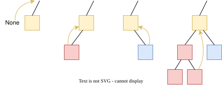

---
# 削除 / remove

```python
def remove_impl(node: TreeNode | None, value: int) -> TreeNode | None:
    if node is None:
        return None
    elif node.value == value:
        if node.left is None and node.right is None:
            return None
        elif node.left is None:
            return node.right
        elif node.right is None:
            return node.left
        else:
            max_value: int = search_max(node.left)
            node.left = remove_impl(node.left, max_value)
            node.value = max_value
            return node
    elif node.value > value:
        node.left = remove_impl(node.left, value)
        return node
    else:
        node.right = remove_impl(node.right, value)
        return node
```

---
# 削除 / remove

```python
def search_max(node: TreeNode) -> int:
    pos: TreeNode = node
    while pos.right is not None:
        pos = pos.right
    return pos.value

def remove(tree: BinarySearchTree, value: int):
    tree.root = remove_impl(tree.root, value)
```

---
# 計算量

各操作の計算量は木の高さ$h$に対して$O(h)$。木が平衡なら$h = O(\log n)$になる


||挿入|探索|削除|
|---|:---:|:---:|:---:|
|平均|$O(\log n)$|$O(\log n)$|$O(\log n)$|
|最悪値|$O(n)$|$O(n)$|$O(n)$|

平均値は挿入順がランダムな場合などを想定する。AVL木などの平衡二分探索木では、高さを$O(\log n)$に保つ

---
<!-- _class: lead -->

# まとめ

---
# まとめ

アルゴリズムを知るといろんな問題の「解き方」がわかる

本資料のアルゴリズムやデータ構造は基本的なものであり、実際に実装することは少ない

どのアルゴリズムやデータ構造を使えばいいかの判断が重要

---
<!-- _class: lead -->
<!-- header: "コメント" -->

# コメント 
資料作成について悩んだこと

---
# クイックソート | partitionの仕様

- 「rightは含まない」に統一しているので、 right - 1を使うなどちょっとわかりにくいかも。
- whileで条件を書くより、無限ループにしてしまって breakする方が自然？
  - 無限ループの是非はあるので...
- 「pivotは前半後半どっちにしても良い」とした方が綺麗に書ける
  - ただ、分かりにくい？

---
# マージソート | ワーキングメモリの確保

リストに`append`で追加していけば、`s`が不要になるのだが以下の理由で不採用
- オブジェクト指向的な書き方になる
- スタック・キューとソートの学習順をどうするか

```python
def merge_list(data: list[int], left: int, mid: int, right: int):
    p : int = left
    q : int = mid
    working : list[int] = list()

    while p < mid and q < right:
        if data[p] < data[q]:
            working.append(data[p])
            p += 1
        else:
            working.append(data[q])
            q += 1
    # 余った要素の追加とdataへの書き戻しは省略
```

---
# マージソート | マージ結果の戻し方

```python
data[left:right] = working
```
この記述手法はちょっと特殊ではあるので `for`文で書いた方がいいかも
```python
for i in range(left, right):
    data[i] = working[i - left]
```

ちなみに、以下の記述でも結果は同じであるが、右辺の`working[0:s]`が新しいリストを作るため、要素への参照のコピーが追加で発生する
```python
data[left:right] = working[0:s]
```

---
# 構造体 | 構造体とクラスを同一化していいのか？


- 「オブジェクト指向」の前に学習する「アルゴリズムとデータ構造」という講義を想定しているので、「構造体」としてクラスを使っている
  - `class`と`struct`は別ものなのではないか？
  - 講義なのでちゃんと「定義」にしたがって教えるべきである

- 個人的には、以下の理由から同一化していいのでは？と考えている
  - 構造体とクラスを区別している言語がそんなにないのではないか？
    - 本来の構造体の役割はrecordではないのか？
  - オブジェクト指向への繋ぎを考えると最初からクラスでいいのでは
    - そもそもデータの操作はメンバ関数として定義した方が分かりやすい...

---
# 構造体 | 構造体 (struct) とクラス (class)

言語によって定義は異なっている

| | struct | class | 備考 |
|---|:--:|:--:|---|
| C | ○ | × | |
|C++| ○ | ○ | デフォルトが publicかprivateか |
| C# | ○ | ○ | 値型と参照型の違い |
|Java| × | ○ | 構造体に近いrecordがある |
|Rust| ○ | × | 機能的にはクラス |
|Swift| ○ | ○ | 値型と参照型の違い |
|Python| × | ○ | |
---
# 構造体 | immutableとmutable

引数にはオブジェクトへの参照が渡り、mutableかimmutableかで渡し方は変わらない

||mutable（変更可）| immutable（変更不可） |
|--|--|--|
| オブジェクト自体の変更 | 可能。呼び出し元にも見える | 不可 |
| 引数への再代入 | 呼び出し元の変数には影響しない | 同左 |
| 例 | list, dict, set, 本資料の構造体 | int, float, str, tuple |

ここの部分は既にソートでは使っているので、関数内での変更が外に影響するかどうか？は最初に説明してもいいかもしれない。

---
# 構造体 | 初期化関数

初期化関数で`self`がでてくるので、理解が難しいのではないか？と思って`dataclass`を使うようにした
Pythonの初期化関数がちょっと分かりにくいといえば分かりにくい気はする。

```python
class Point:
    x: int
    y: int

    def __init__(self, x: int, y: int):
        self.x = x
        self.y = y
```

